# metacubexd

**SingBox 控制面板，非官方版，XD**

[](https://github.com/metacubex/metacubexd/pulls)
[](https://github.com/metacubex/metacubexd/commits)
[](https://github.com/metacubex/metacubexd/actions)
[](https://github.com/metacubex/metacubexd/releases)
[](./LICENSE)

[中文](README-zh.md) | [English](README.md)

## ✨ 特色买点

- 📊 实时流量监控与统计
- 🔄 代理组管理（含延迟测试）
- 📡 连接追踪与管理
- 📋 带搜索功能的规则查看器
- 📝 实时日志流
- 🎨 精美界面，支持浅色/深色主题
- 📱 全响应式设计，适配移动端
- 🌐 多语言支持（英文、中文、俄语）

## 🖼️ 预览

<details>
<summary><b>电脑端截图</b></summary>

|                           Overview                            |                           Proxies                           |
| :-----------------------------------------------------------: | :---------------------------------------------------------: |
| 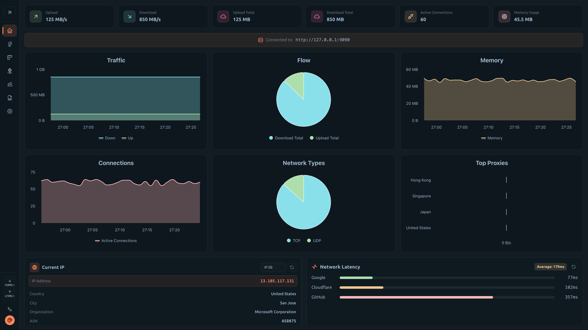 | 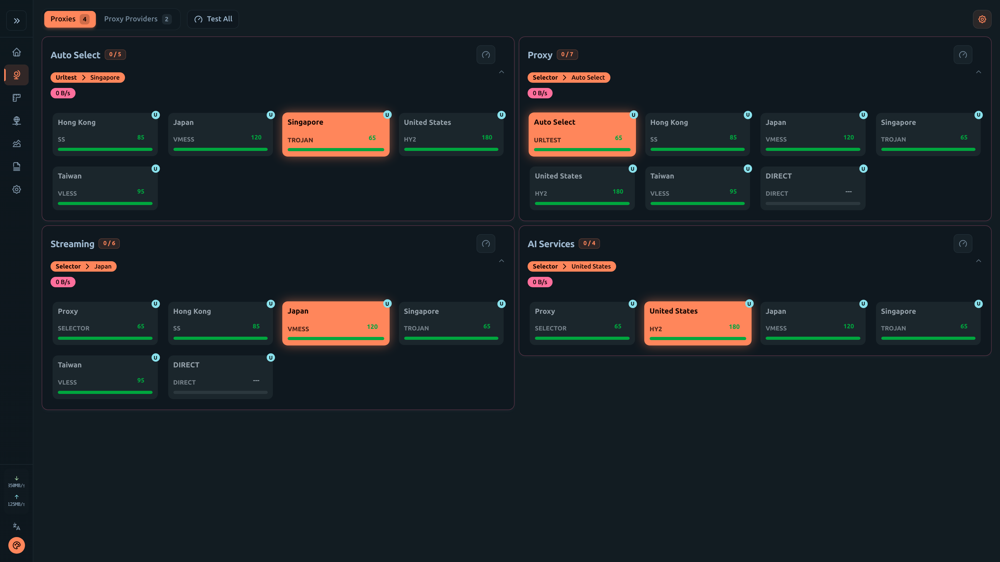 |

|                             Connections                             |                          Rules                          |
| :-----------------------------------------------------------------: | :-----------------------------------------------------: |
| 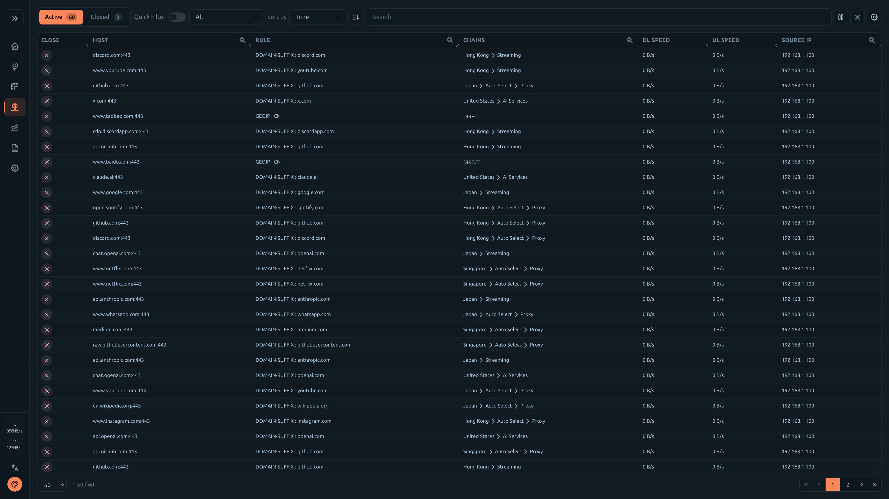 | 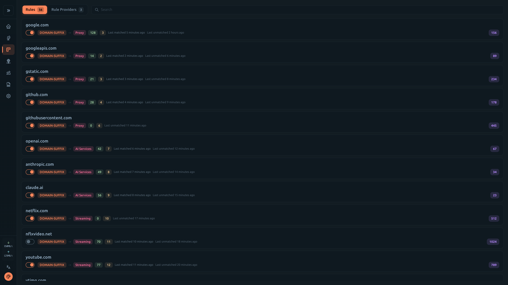 |

|                         Logs                          |                          Config                           |
| :---------------------------------------------------: | :-------------------------------------------------------: |
| 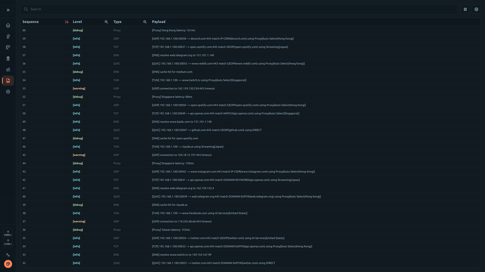 | 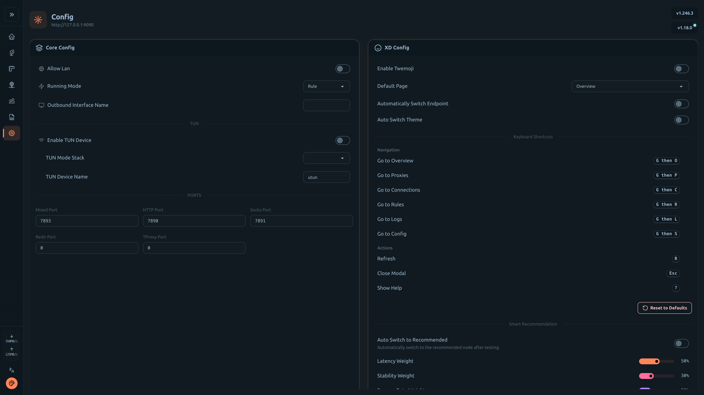 |

</details>

<details>
<summary><b>手机端截图</b></summary>

|                             Overview                              |                             Proxies                             |                               Connections                               |
| :---------------------------------------------------------------: | :-------------------------------------------------------------: | :---------------------------------------------------------------------: |
| 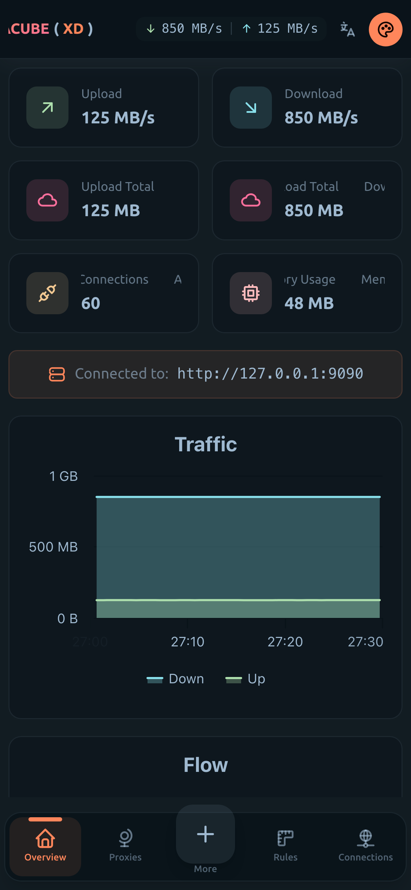 | 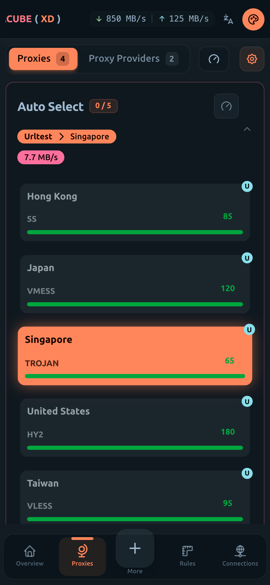 | 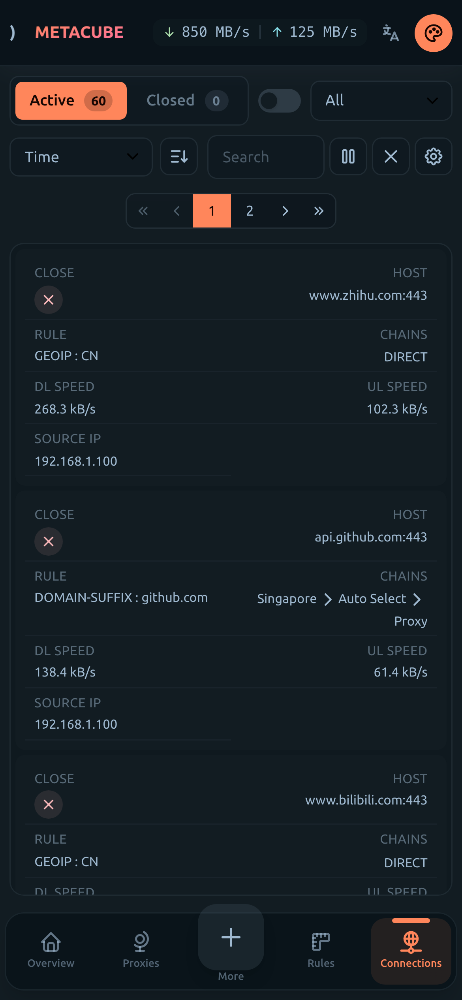 |

|                            Rules                            |                           Logs                            |                            Config                             |
| :---------------------------------------------------------: | :-------------------------------------------------------: | :-----------------------------------------------------------: |
| 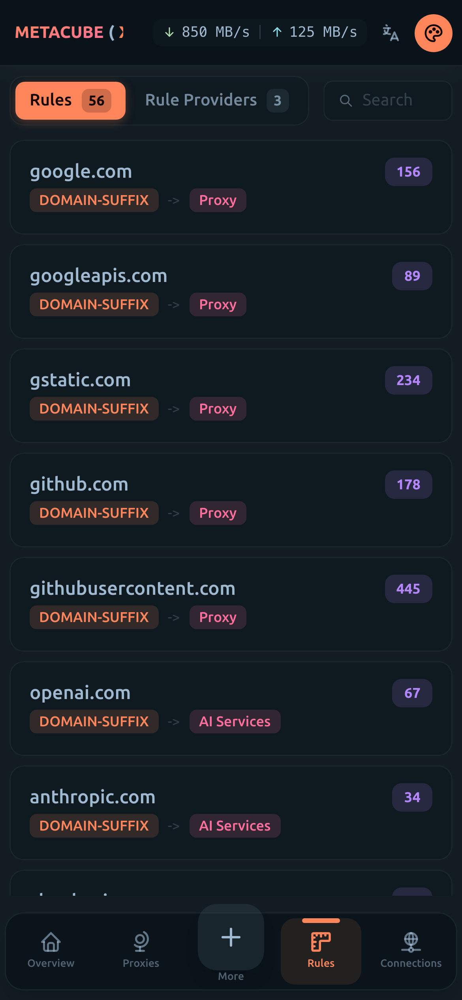 | 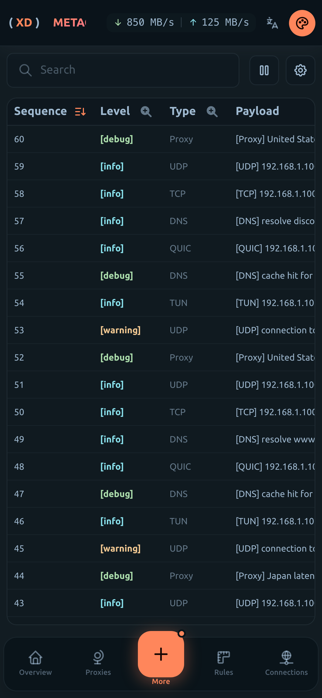 | 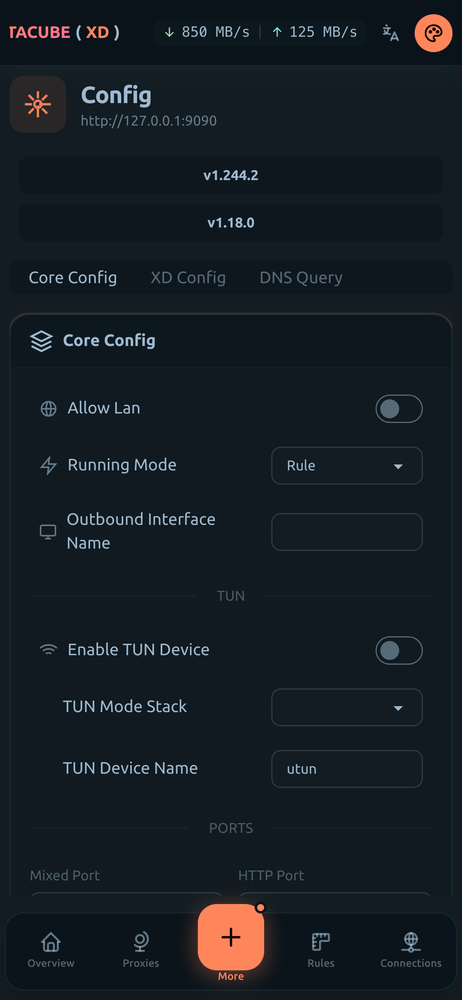 |

</details>

## 🔗 官方链接

| 托管平台         | URL                                    |
| :--------------- | :------------------------------------- |
| GitHub Pages     | https://metacubex.github.io/metacubexd |
| Cloudflare Pages | https://metacubexd.pages.dev           |

## 🚀 快速开始

### 提前准备

在你的 singbox 配置中打开 external-controller :

```yaml
external-controller: 0.0.0.0:9090
```

### 方案 1: 使用预构建资源

```shell
# 拉取 gh-pages 分支
git clone https://github.com/metacubex/metacubexd.git -b gh-pages /ui

# Set external-ui in your config
# external-ui: /ui

# 升级
git -C /ui pull -r
```

### 方案 2: 使用Docker

```shell
# Basic usage
docker run -d --restart always -p 80:80 --name metacubexd ghcr.io/metacubex/metacubexd

# 带有自定义的默认后端URL
docker run -d --restart always -p 80:80 --name metacubexd \
  -e DEFAULT_BACKEND_URL=http://192.168.1.1:9090 \
  ghcr.io/metacubex/metacubexd

# 升级
docker pull ghcr.io/metacubex/metacubexd && docker restart metacubexd
```

<details>
<summary><b>Docker Compose</b></summary>

```yaml
services:
  metacubexd:
    container_name: metacubexd
    image: ghcr.io/metacubex/metacubexd
    restart: always
    ports:
      - '80:80'
    # environment:
    #   - DEFAULT_BACKEND_URL=http://192.168.1.1:9090

  # Optional: mihomo instance
  mihomo:
    container_name: mihomo
    image: docker.io/metacubex/mihomo:Alpha
    restart: always
    pid: host
    network_mode: host
    cap_add:
      - ALL
    volumes:
      - ./config.yaml:/root/.config/mihomo/config.yaml
      - /dev/net/tun:/dev/net/tun
```

```shell
docker compose up -d

# 升级
docker compose pull && docker compose up -d
```

</details>

### 方案 3: 源码构建

```shell
# 安装依赖
pnpm install

# 为静态托管构建（如 GitHub Pages 等，输出在 /dist）
pnpm generate

# 预览
pnpm preview
```

## 🛠️ 开发步骤

```shell
# 开一个dev服务器
pnpm dev

# 使用模拟数据启动开发服务器
pnpm dev:mock

# 代码校验与格式化
pnpm lint
pnpm format
```

## 📄 许可

[MIT](./LICENSE)

## 🙏 感谢

- [Nuxt](https://github.com/nuxt/nuxt) - The Intuitive Vue Framework
- [Vue.js](https://github.com/vuejs/core) - The Progressive JavaScript Framework
- [daisyUI](https://github.com/saadeghi/daisyui) - Tailwind CSS components
- [Tailwind CSS](https://tailwindcss.com) - Utility-first CSS framework
